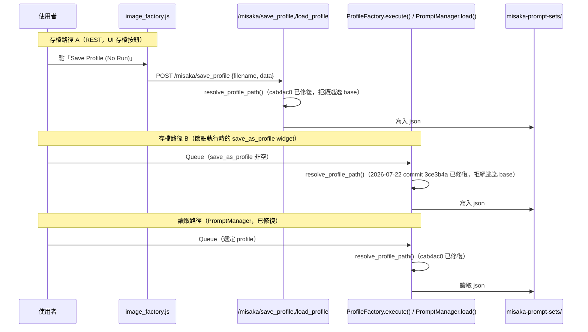

## 設計說明

管理「checkpoint + LoRA(s) + 分類 prompt」的可重複使用設定檔（profile），取代原本用一堆資料夾
分類（`/{checkpoint}/{角色分類}/{角色名字}/{動作場景}`）的手動流程。兩個節點構成存取的一體兩面：

- **Misaka Image Profile Factory（Editor/Saver）**——建立、編輯、儲存 profile。
- **Misaka Image Prompt Manager（Loader）**——列出並載入已存的 profile。

兩者共用 `nodes/image/factory/_shared.py` 的 `apply_assets()`（載入 checkpoint + 逐一套用
LoRA + 依 `clip_skip` 做 CLIP 分層跳過 + 編碼 prompt）與 `process_output_name()`（輸出檔名模板
解析,見下方）。

### Factory 欄位與存檔邏輯

`INPUT_TYPES`：`checkpoint`（下拉）、`character`/`H`/`expression`/`pose`/`scene`（五個多行分類
prompt 欄位，取代舊版單一 `positive` 字串）、`output_name`、`save_as_profile`、`clip_skip`；
`optional`：`lora_1` + 對應 strength（UI 動態擴充多組，見 BP-UI-1）、`node_map`/`lora_data`（隱藏，
由 JS `onSerialize` 自動寫入，見 BP-UI-1）。

`execute()`：`lora_data`（JSON）優先於單一 `lora_1` widget 組成最終 LoRA 清單；若
`save_as_profile` 非空，計算存檔路徑（`checkpoint` 檔名去副檔名作子資料夾，除非
`output_name`/儲存路徑以 `/` 開頭）、從當前 workflow 圖中找 `title == "note"` 且
`type == "CLIPTextEncode"` 的節點取值存入 `note` 欄位，寫出 profile JSON
（`nodes/image/factory/profile_factory.py:67-103`）。

### Manager 載入邏輯

`INPUT_TYPES` 動態列出 `get_storage_path()` 下所有 `.json`（遞迴子資料夾，相對路徑作 id）。
`load()` 相容兩種 profile 格式：新版分類欄位（`character`/`H`/`expression`/`pose`/`scene`）與
舊版單一 `positive` 字串（向後相容判斷：`has_new = any(k in data for k in new_keys)`）。

### 輸出檔名模板（`process_output_name`）

`output_name` 支援 `%NodeTitle.field%` / `%NodeId.field%` 模板語法,在執行時從當前 prompt 圖
即時取值（例：`%KSampler.seed%` 取該節點 `seed` 輸入的當前值；`.field` 含 `seed` 時額外
容錯查 `noise_seed`）。除非模板以 `/` 開頭，否則自動在最前面加上 `{checkpoint 檔名去副檔名}/`
前綴（對應原始需求：`output_name = 角色分類/角色名字_%Seed.seed%` →
`qweasdV123/角色分類/角色名字_%Seed.seed%`）。最終路徑再統一加 `images/` 前綴
（2026-02-15，`a78cd58`）。

### Profile 儲存位置（刻意置於外部）

`get_storage_path()` 回傳 `<plugin_root>/../../user/default/misaka-prompt-sets`——
ComfyUI 的 `user/default/` 目錄下，刻意與外掛程式碼分開存放（對應原始需求「我希望這個node存的
資料會在外部...而不是跟node程式碼放在一起」）。

## 存/讀流程（含路徑防護現況）

## 已修復（2026-07-22，commit 3ce3b4a）

`MisakaImageProfileFactory.execute()` 的 `save_as_profile` 存檔路徑
（原 `nodes/image/factory/profile_factory.py:73`）曾用 `os.path.join(base_path, save_as_profile.strip() + ".json")`
直接組路徑,**沒有呼叫** `resolve_profile_path()`——這與 `cab4ac0`（2026-06-20）修的
REST `/misaka/save_profile` 路由、`MisakaImagePromptManager.load()` 不同（見 BP-API-1）。
ComfyUI 的執行 API（`POST /prompt`）接受完整 workflow JSON（含 widget 值）,任何呼叫者理論上
可送出一個把 `save_as_profile` 設為 `../../../xxx` 的 graph,透過此節點的 `execute()` 寫檔到
storage root 之外——REST 路由的修復當時未覆蓋這條路徑。

**修復**：`execute()` 改用與路由/Manager 相同的 `resolve_profile_path(base_path, save_as_profile.strip())`
計算存檔路徑,拒絕（`ValueError`）時走既有 `except Exception` 分支（記錄 log、不寫檔),
行為與 REST 路由一致。先以 `tests/test_path_traversal.py::test_node_save_traversal_rejected`
在修復前跑出 RED（`'../escaped'` 確實逃逸至 storage root 外),修復後轉 PASS,並新增
`test_node_save_normal_name_still_saves` 覆蓋一般名稱仍可正常存檔的迴歸(見 `tests` 欄位)。
