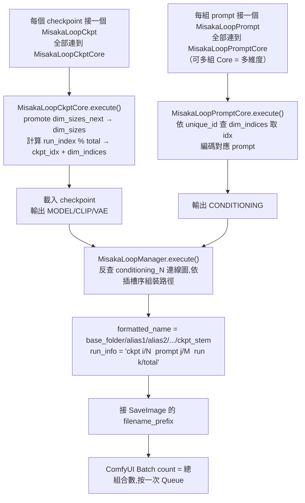

## 設計說明

在同一次「Queue」批次中,自動輪替不同 checkpoint × 不同 prompt 的組合生成圖片,取代手動
逐一切換 checkpoint/prompt 重複執行的流程。目前為**五個節點的組合架構**（README 僅記載較早的
簡化版兩節點介面,見下方落差說明）：

| 節點 | 角色 | 輸出 |
|---|---|---|
| `MisakaLoopCkpt` | UI 選擇器：checkpoint 下拉,原樣傳出字串 | `ckpt_name` (STRING) |
| `MisakaLoopPrompt` | UI 選擇器：`alias` + `text` 包成一個 wire | `MISAKA_PROMPT` (alias, text) |
| `MisakaLoopCkptCore` | 實際執行：接收多個 `ckpt_name_N`（動態插槽,見 BP-UI-2）,依當前 run index 選一個載入 | `MODEL`/`CLIP`/`VAE` |
| `MisakaLoopPromptCore` | 實際執行：接收多個 `prompt_N`（動態插槽）,依當前 run index 選一個並編碼 | `CONDITIONING` |
| `MisakaLoopManager` | 組裝最終輸出路徑 + 執行進度字串 | `formatted_name`/`run_info` |

### 狀態機（`_state.py:_LoopState`，module-level singleton，`threading.Lock` 保護）

- `run_index`/`current_run`：全域執行計數器,每次 `CkptCore.execute()` 時 `% total` 遞增。
- Ckpt 為**最外層（最慢）維度**；每個 `PromptCore` 節點透過 `unique_id` 作為獨立
  維度 key,寬度（連了幾個 `prompt_N`）寫入 `dim_sizes_next`,下次 `CkptCore` 執行時「promote」
  成 `dim_sizes`（pending/committed 兩階段,避免刪除某個 `PromptCore` 節點後殘留過期維度）。
- 總執行次數 = `N_ckpts × dim_size_1 × dim_size_2 × …`；index 計算用「里程表」演算法
  （outermost=ckpt,越後加入的維度循環越快）。
- 無 `CkptCore`（solo 模式）時,`PromptCore` 自己用 `solo_indices` 循環,不受 ckpt 維度影響。

### 交叉生圖流程

`reset_counter`（`MisakaLoopManager`）：勾選後下次執行時把 `run_index` 歸零,從第一個組合
重新開始。`IS_CHANGED` 回傳 `float("nan")` 讓這幾個節點每次 Queue 都強制重新執行（不被
ComfyUI 的快取機制跳過）。

## README 現況落差（誠實記錄）

`README.md` 第 6/7 節（EN/zh-TW/日本語三處皆同）描述的是 **2026-05-13 到 2026-05-24
之間的簡化版介面**：`Misaka Loop Ckpt` 直接輸出 `MODEL`/`CLIP`/`VAE`/`ckpt_name`/`run_info`,
`Misaka Loop Prompt` 直接輸出 `CONDITIONING`/`formatted_name`。`b13acaa`（2026-05-24）拆分為
上表五節點架構後,README 未同步更新——目前 `MisakaLoopCkpt`/`MisakaLoopPrompt` 只是把值原樣
傳出的 UI 選擇器,真正的載入/編碼/路徑組裝邏輯在 `*Core` 與 `MisakaLoopManager`。此落差已在
`@PM` registry `ComfyUI-misaka-prompt-manager.md` 記錄為待補項目,本條目記錄設計現況以此
blueprint 為準。
