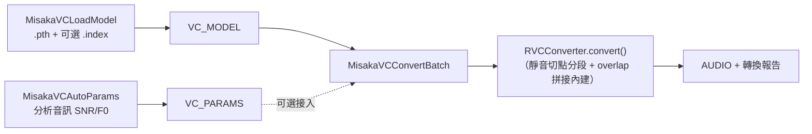

## 設計說明

RVC（Retrieval-based Voice Conversion）語音轉換管線,四個節點分工：

| 節點 | 用途 | 輸出 |
|---|---|---|
| `MisakaVCLoadModel` | 載入 `.pth`（可選 `.index`),建立 `RVCConverter` 實例 | `VC_MODEL` |
| `MisakaVCAutoParams` | 分析音訊,建議 `index_rate`/`protect`/建議模型採樣率 | `VC_PARAMS` + 文字報告 |
| `MisakaVCConvertBatch` | 用 `VC_MODEL` 轉換整段音訊 | `AUDIO` + 報告 |
| `MisakaVCAudioInfo` | 純顯示音訊資訊（不轉換） | 文字資訊 |

### `RVCConverter`（`voice/rvc_wrapper.py`，2026-04-26 起 Ultimate-RVC 架構）

不依賴 RVC WebUI 啟動,自建 meta-path finder（`_RVCForkFinder`）攔截 `ultimate_rvc`/`infer`/`lib`
等命名空間的 import,讓 `torch.load()` 能還原 pickle 進去的模型物件,即使執行環境沒裝原始
RVC fork 套件也不會炸（`_make_placeholder_class` 提供彈性 stub）。`convert()` 內建靜音切點
分段與 overlap 拼接（取代原規劃中獨立的 `find_cut_points`/`concat_with_crossfade`，見
SPEC §「已移除死碼」段與 2026-06-20 `a4eaba3` 清理記錄）。

### 自動參數建議（`voice/auto_params.py:analyze_audio`）

依 SNR（訊噪比,`_estimate_snr` 用高低 25/75 百分位 RMS 差估計）與 F0 範圍變異決定建議值：

| SNR | index_rate | protect |
|---|---|---|
| < 20dB（雜訊多） | 0.3 | 0.45 |
| 20–40dB | 0.6 | 0.33 |
| > 40dB（乾淨） | 0.75 | 0.25 |

F0 變異 > 200Hz（日文語音等高變化）時 `protect` 再 +0.05（上限 0.5）。另用
`choose_model_sr()` 依輸入採樣率挑最接近的 RVC 模型版本（32k/40k/48k,避免不必要的向上取樣）。

## 流程

## 安全注意事項（README 已記載，此處對應標註）

`.pth` 模型以 `torch.load(weights_only=False)` 載入（`voice/rvc_wrapper.py:369`），會反序列化
任意 Python pickle，載入時可能執行程式碼——僅應載入可信任來源的模型檔（README `## Security`
段已用三語警示,`GET /misaka/rvc_model_list`/`rvc_index_list` 這兩條路由本身只回傳既有檔案
清單，不涉及使用者輸入的路徑，不在 BP-API-1 的 traversal 範疇內）。
