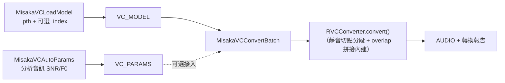

## 設計說明

RVC（Retrieval-based Voice Conversion）語音轉換管線,四個節點分工：

| 節點 | 用途 | 輸出 |
|---|---|---|
| `MisakaVCLoadModel` | 載入 `.pth`（可選 `.index`),建立 `RVCConverter` 實例 | `VC_MODEL` |
| `MisakaVCAutoParams` | 分析音訊,建議 `index_rate`/`protect`/建議模型採樣率 | `VC_PARAMS` + 文字報告 |
| `MisakaVCConvertBatch` | 用 `VC_MODEL` 轉換整段音訊 | `AUDIO` + 報告 |
| `MisakaVCAudioInfo` | 純顯示音訊資訊（不轉換） | 文字資訊 |

### `RVCConverter`（`voice/rvc_wrapper.py`，2026-04-26 起 Ultimate-RVC 架構）

不依賴 RVC WebUI 啟動,自建 meta-path finder（`_RVCForkFinder`）攔截 `ultimate_rvc`/`infer`/`lib`
等命名空間的 import,讓 `torch.load()` 能還原 pickle 進去的模型物件,即使執行環境沒裝原始
RVC fork 套件也不會炸（`_make_placeholder_class` 提供彈性 stub）。`convert()` 內建靜音切點
分段與 overlap 拼接（取代原規劃中獨立的 `find_cut_points`/`concat_with_crossfade`，見
SPEC §「已移除死碼」段與 2026-06-20 `a4eaba3` 清理記錄）。

### 自動參數建議（`voice/auto_params.py:analyze_audio`）

依 SNR（訊噪比,`_estimate_snr` 用高低 25/75 百分位 RMS 差估計）與 F0 範圍變異決定建議值：

| SNR | index_rate | protect |
|---|---|---|
| < 20dB（雜訊多） | 0.3 | 0.45 |
| 20–40dB | 0.6 | 0.33 |
| > 40dB（乾淨） | 0.75 | 0.25 |

F0 變異 > 200Hz（日文語音等高變化）時 `protect` 再 +0.05（上限 0.5）。另用
`choose_model_sr()` 依輸入採樣率挑最接近的 RVC 模型版本（32k/40k/48k,避免不必要的向上取樣）。

## 流程

```mermaid
flowchart LR
    A["MisakaVCLoadModel<br/>.pth + 可選 .index"] --> D["VC_MODEL"]
    B["MisakaVCAutoParams<br/>分析音訊 SNR/F0"] --> E["VC_PARAMS"]
    D --> C["MisakaVCConvertBatch"]
    E -.可選接入.-> C
    C --> F["RVCConverter.convert()<br/>（靜音切點分段 + overlap 拼接內建）"]
    F --> G["AUDIO + 轉換報告"]
```

## 安全注意事項（README 已記載，此處對應標註）

**2026-09-07 起已修復（待回答 #49，見下方 qa_log）：** `.pth` 模型現在預設透過
`voice/_safe_load.py:load_checkpoint()`（`voice/rvc_wrapper.py:load_rvc_checkpoint()` 呼叫）先以
`torch.serialization.get_unsafe_globals_in_checkpoint()` 靜態掃描（不 unpickle）決定是否需要
`weights_only=False`：掃描回報「無未被允許全域物件」就只走 `weights_only=True` 安全路徑；掃描
回報有未被允許全域物件才印出＋記錄明確警告（含檔案路徑與物件名稱）並退回舊式
`weights_only=False` 載入；`MISAKA_PM_RVC_STRICT_LOAD=1`（或 `true`/`yes`/`on`，大小寫不拘）
可停用退回、直接拒絕。**同日 FRESH opus 複核（F1–F7）後再修復一輪：** 損毀／截斷／垃圾位元組
檔案現在會在靜態掃描階段直接往外拋例外，絕不誤觸退回、絕不印警告（修復前是攔截例外型別來
判斷，會把單純檔案損毀誤判成需要退回）；`voice/rvc_wrapper.py:_rvc_safe_globals()` 新增一個
明確 review 過的 fork 全域物件 binding（`ultimate_rvc.typing_extra.TrainingSampleRate` →
`_StaticForkGlobalPlaceholder`），使站主 `yuuka_best.pth` 現在也直接走安全路徑、不再需要退回。
以下描述的「反序列化任意 pickle」風險現在僅在下列情況才成立：checkpoint 引用了尚未被逐一
review 並 allowlist 的 fork 全域物件（README `## Security` 段已同步更新三語警示）。
`GET /misaka/rvc_model_list`/`rvc_index_list` 這兩條路由本身只回傳既有檔案清單，不涉及使用者
輸入的路徑，不在 BP-API-1 的 traversal 範疇內。
