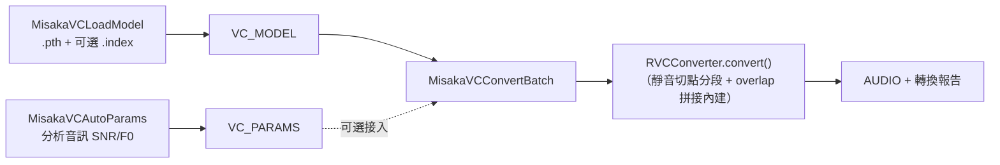

> 以下各節為 `docs/superpowers/specs/SPEC-voice-conversion.md`（已移除，見
> `docs/blueprint/MIGRATION.md` §1）對應章節的逐字照抄；PM 撰寫的說明/圖表移至文末
> 「補充（非原文）」。

## 目錄結構（新增部分）

```
  nodes/voice/             # 實際 ComfyUI 節點實作（取代原規劃的 voice_nodes.py）
    load_model.py / auto_params.py / convert_batch.py / audio_info.py / pm_generate.py
```

## 依賴套件（requirements 新增）

```
# 音訊處理
librosa>=0.10.0          # 靜音偵測、頻譜分析
soundfile>=0.12.1        # WAV 讀寫
soxr>=0.3.7              # 高品質重採樣（比 scipy 快且無 aliasing）
numpy>=1.26.0
```

```
# RVC 依賴（需使用者自行安裝 RVC 環境）
# faiss-gpu              # 向量索引（RVC .index 搜尋）
# torchcrepe             # F0 基頻偵測
# pyworld                # WORLD 聲碼器（harvest F0）
```

```
# 可選：品質評估
pesq>=0.0.4              # 語音品質感知分數（用於 auto_params）
```

### `voice/resampler.py`

**功能**：高品質重採樣，處理輸入音訊與 RVC 模型原生採樣率之間的轉換。

```python
def resample(audio: np.ndarray, src_sr: int, dst_sr: int) -> np.ndarray:
    """使用 soxr 的 HQ 品質設定，無 aliasing。"""

def detect_sr(path: str) -> int:
    """讀取音訊檔案的採樣率（不載入全部音訊）。"""

def choose_model_sr(input_sr: int, available: list[int] = [32000, 40000, 48000]) -> int:
    """
    根據輸入採樣率選擇最接近的 RVC 模型版本。
    例：input_sr=44100 → 選 40000（避免向上過採樣）
    """
```

### `voice/auto_params.py`

**功能**：分析輸入音訊，自動建議 RVC 最佳參數。

```python
def analyze_audio(path: str) -> dict:
    """
    回傳:
    {
      "sr": int,                    # 偵測到的採樣率
      "duration": float,            # 秒數
      "snr_db": float,              # 估計訊噪比
      "is_speech": bool,            # 是否包含語音
      "f0_range": (float, float),   # 基頻範圍（Hz）
      "recommended_model_sr": int,  # 建議的 RVC 模型採樣率
      "recommended_index_rate": float,  # 建議 index_rate（0.0~1.0）
      "recommended_protect": float,     # 建議 protect（子音保護，0.0~0.5）
      "note": str,                  # 文字說明原因
    }
    """

def recommend_hop_length(duration_sec: float, sr: int) -> int:
    """
    根據音訊長度決定 F0 分析的 hop_length。
    短音訊（<5s）→ 小 hop（高解析）；長音訊 → 大 hop（降低計算量）。
    """
```

**參數決策邏輯**：

| 條件 | index_rate | protect |
|------|-----------|---------|
| SNR < 20dB（雜訊多）| 0.3 | 0.45 |
| SNR 20-40dB | 0.6 | 0.33 |
| SNR > 40dB（乾淨） | 0.75 | 0.25 |
| 日文語音（f0 高變化） | +0.0 | +0.05 |

### `voice/rvc_wrapper.py`

**功能**：統一封裝 RVC 推理，不依賴 RVC WebUI 啟動。

```python
class RVCConverter:
    def __init__(
        self,
        model_path: str,      # .pth 檔案路徑
        index_path: str = "", # .index 檔案路徑（空字串則不使用）
        device: str = "cuda", # "cuda" / "cpu"
    ): ...

    def convert(
        self,
        audio: np.ndarray,
        src_sr: int,
        f0_method: str = "harvest",   # "harvest" / "crepe" / "rmvpe"
        f0_up_key: int = 0,           # 音高偏移（半音）
        index_rate: float = 0.6,
        protect: float = 0.33,
        filter_radius: int = 3,
    ) -> tuple[np.ndarray, int]:
        """回傳 (converted_audio, output_sr)"""
```

**注意**：`RVCConverter` 假設使用者已安裝 RVC 依賴，`__init__` 中做 import 而非 top-level，失敗時印出清楚的安裝提示。

## ComfyUI 節點規格（`voice_nodes.py`）

### Node 1：`MisakaVCLoadModel`

**用途**：載入 RVC 模型，建立 `RVCConverter` 實例。

```python
INPUT_TYPES:
  required:
    model_path:  STRING  （.pth 完整路徑）
    f0_method:   COMBO   ["harvest", "crepe", "rmvpe"]  default="harvest"
    device:      COMBO   ["cuda", "cpu"]                default="cuda"
  optional:
    index_path:  STRING  （.index 完整路徑，空白則不使用）

RETURN_TYPES:  ("VC_MODEL",)
RETURN_NAMES: ("vc_model",)
```

### Node 2：`MisakaVCAutoParams`

**用途**：分析音訊，自動建議轉換參數。

```python
INPUT_TYPES:
  required:
    audio_path:  STRING

RETURN_TYPES:  ("VC_PARAMS", "STRING")
RETURN_NAMES: ("vc_params", "analysis_report")
```

`VC_PARAMS` 為包含 `index_rate / protect / f0_up_key / filter_radius / model_sr` 的 dict。
`analysis_report` 為純文字說明（可接到 ShowText 節點）。

### Node 3：`MisakaVCConvertBatch`

**用途**：長音訊 batch 轉換（含自動分段 + cross-fade 拼接）。

```python
INPUT_TYPES:
  required:
    vc_model:    VC_MODEL
    audio_path:  STRING              （輸入音訊路徑）
    output_path: STRING              （輸出路徑，含副檔名）
  optional:
    vc_params:   VC_PARAMS           （接 AutoParams；不接則使用下方手動值）
    f0_up_key:       INT    default=0,    min=-12, max=12
    index_rate:      FLOAT  default=0.6, min=0.0,  max=1.0, step=0.01
    protect:         FLOAT  default=0.33,min=0.0,  max=0.5, step=0.01
    filter_radius:   INT    default=3,   min=0,    max=7
    min_silence_ms:  INT    default=300, min=100,  max=2000
    overlap_ms:      INT    default=150, min=50,   max=500
    fade_ms:         INT    default=100, min=10,   max=300
    max_segment_sec: FLOAT  default=15.0,min=3.0,  max=60.0

RETURN_TYPES:  ("STRING", "STRING")
RETURN_NAMES: ("output_path", "report")
```

**執行流程（實際實作）**：
1. 載入音訊 → `detect_sr()` → 轉單聲道 float32
2. `converter.convert()` —— 分段（靜音切點）與 overlap 拼接由 `RVCConverter.convert()`
   內部處理（Ultimate-RVC 演算法），不需外部 `find_cut_points` / `concat_with_crossfade`
3. 若提供 `output_path` 則 `soundfile.write()` 輸出，否則回傳 `AUDIO`

> 註：上方 `min_silence_ms` / `overlap_ms` / `fade_ms` / `max_segment_sec` 為原規格的
> 外部分段參數，實際實作未暴露 —— 分段已內建於 wrapper，這些旋鈕目前不存在。

### Node 6：`MisakaVCAudioInfo`

**用途**：顯示音訊基本資訊（不轉換），方便 debug。

```python
INPUT_TYPES:
  required:
    audio_path: STRING

RETURN_TYPES:  ("STRING",)
RETURN_NAMES: ("info",)
```

輸出格式：
```
路徑: xxx.wav
時長: 3m 24s
採樣率: 44100 Hz → 建議模型: 40000 Hz
聲道: 1 (mono)
SNR 估計: 38.2 dB
F0 範圍: 120~380 Hz
```

## 型別定義

```python
# voice 型別（需在 NODE_CLASS_MAPPINGS 旁邊定義）
# ComfyUI 識別自訂型別的方式：RETURN_TYPES 中用大寫字串即可，
# 不需額外宣告，只要收發節點用相同字串就會自動連線。

# VC_MODEL  → RVCConverter 實例
# VC_PARAMS → dict（index_rate, protect, f0_up_key, filter_radius, model_sr）
```

## 實作注意事項

1. **RVC import 保護**：`rvc_wrapper.py` 的 `from rvc.xxx import ...` 全部包在 `try/except ImportError`，失敗時 `print("[MisakaVC] 請安裝 RVC 依賴：...")` 而不是 crash ComfyUI。

2. **GPU 記憶體**：`RVCConverter.__init__` 載入模型後呼叫 `torch.cuda.empty_cache()`；batch 轉換各段之間也清一次。

4. **輸出採樣率**：batch 轉換的最終輸出維持 RVC 模型的原生採樣率（32k/40k/48k），不在 pipeline 中途降採樣。若需要特定格式，由使用者在節點後接 `MisakaResample` 節點。

## 補充（非原文）

> 以下為 PM 於遷移時撰寫的說明性內容（非 SPEC 原文），移到此處保留，不併入上方逐字段落。

### 設計說明

RVC（Retrieval-based Voice Conversion）語音轉換管線,四個節點分工：

| 節點 | 用途 | 輸出 |
|---|---|---|
| `MisakaVCLoadModel` | 載入 `.pth`（可選 `.index`),建立 `RVCConverter` 實例 | `VC_MODEL` |
| `MisakaVCAutoParams` | 分析音訊,建議 `index_rate`/`protect`/建議模型採樣率 | `VC_PARAMS` + 文字報告 |
| `MisakaVCConvertBatch` | 用 `VC_MODEL` 轉換整段音訊 | `AUDIO` + 報告 |
| `MisakaVCAudioInfo` | 純顯示音訊資訊（不轉換） | 文字資訊 |

### 流程


```mermaid
flowchart LR
    A["MisakaVCLoadModel<br/>.pth + 可選 .index"] --> D["VC_MODEL"]
    B["MisakaVCAutoParams<br/>分析音訊 SNR/F0"] --> E["VC_PARAMS"]
    D --> C["MisakaVCConvertBatch"]
    E -.可選接入.-> C
    C --> F["RVCConverter.convert()<br/>（靜音切點分段 + overlap 拼接內建）"]
    F --> G["AUDIO + 轉換報告"]
```

### 安全注意事項（README 已記載，此處對應標註）

`.pth` 模型以 `torch.load(weights_only=False)` 載入（`voice/rvc_wrapper.py:369`），會反序列化
任意 Python pickle，載入時可能執行程式碼——僅應載入可信任來源的模型檔（README `## Security`
段已用三語警示,`GET /misaka/rvc_model_list`/`rvc_index_list` 這兩條路由本身只回傳既有檔案
清單，不涉及使用者輸入的路徑，不在 BP-API-1 的 traversal 範疇內）。
